# OnlineBrainstorm
2023 클라우드프로그래밍 기말 프로젝트   
프로젝트 협업을 위한 브레인스토밍 플랫폼
---

## 사이트 URL
http://onlinebrainstorm-app.apps.openlab-06.kr/

---

# 목차

1. [프로젝트 개요](#프로젝트-개요)
2. [기능 명세](#기능-명세)
   1. [인증과 인가](#인증과-인가)
   2. [팀 생성](#팀-생성)
   3. [팀 초대](#팀-초대)
   4. [팀 메인 화면과 채널 생성](#팀-메인-화면과-채널-생성)
   5. [팀 동료 확인](#팀-동료-확인)
   6. [4가지 채널 유형](#4가지-채널-유형)
      1. [DOCS](#DOCS)
      2. [THREAD](#THREAD)
      3. [BRAINSTORM](#BRAINSTORM)
      4. [ARGUMENT](#ARGUMENT)

---

# 프로젝트 개요
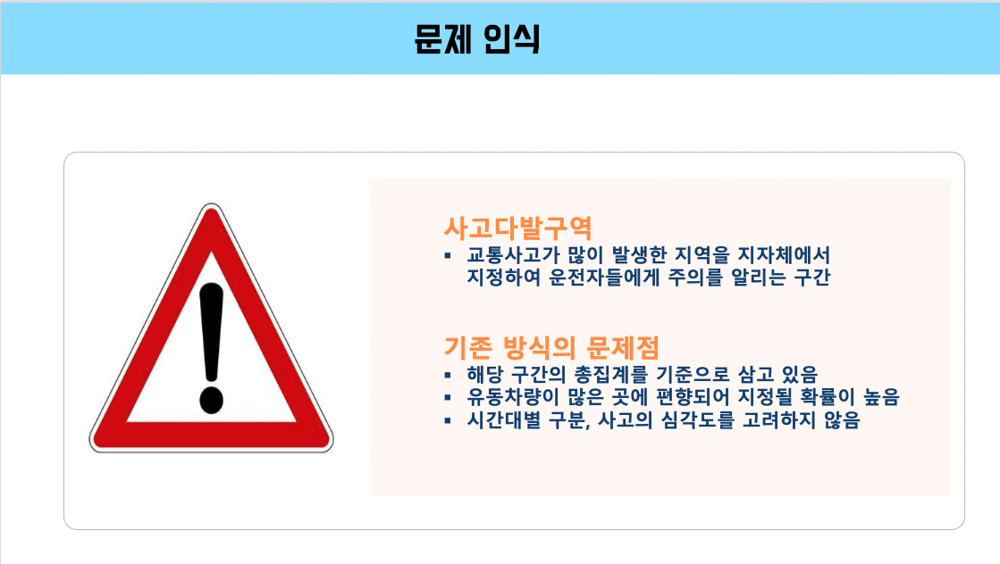
살다보면 우리는 다양한 사람들과 함께 협업을 하게 됩니다. 지금의 협업 도구는 체계적인 규칙에 따라 사용되는 경우가 많으며 이는 업무의 능률을 올려주는 경우가 많은 것이 사실입니다.   
그렇지만, 때로는 뇌에서 생각나는 그대로의 내용을 바탕으로 다양한 아이디어를 쏟아내, 적절한 해결책을 도출하는 방법이 필요할 수 있습니다.    
그래서 자유롭게 협업할 수 있는 협업 도구인 OnlineBrainStorm을 개발하게 되었습니다.  

--------

# 기능 명세
Slack과 유사하게, 회원가입 및 로그인을 진행한 후, 워크스페이스에 해당하는 팀을 개설, 팀에 다른 사용자를 초대하고, 팀 안에서 다양한 유형의 채널을 생성하여 협업할 수 있습니다.

## 인증과 인가
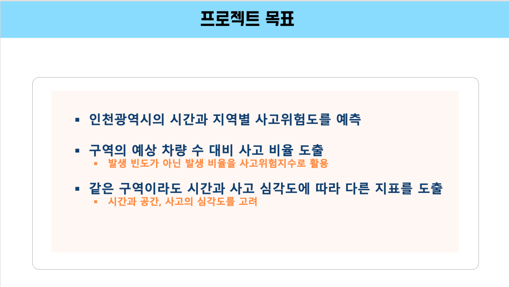
- 로그인을 통한 인증과 인가
- 소셜 로그인(그렇지만, Pass-Ts 클라우드에서 https를 사용하게 하지 못했기에, 배포 환경에서는 구글 로그인을 사용할 수 없음)
- 일반 서비스에 대한 접근은 로그인을 통해 인증받은 유저에 한함
- 팀 내부에 대한 접근 권한은 해당 팀에 속한 유저에 한함

---

## 팀 생성
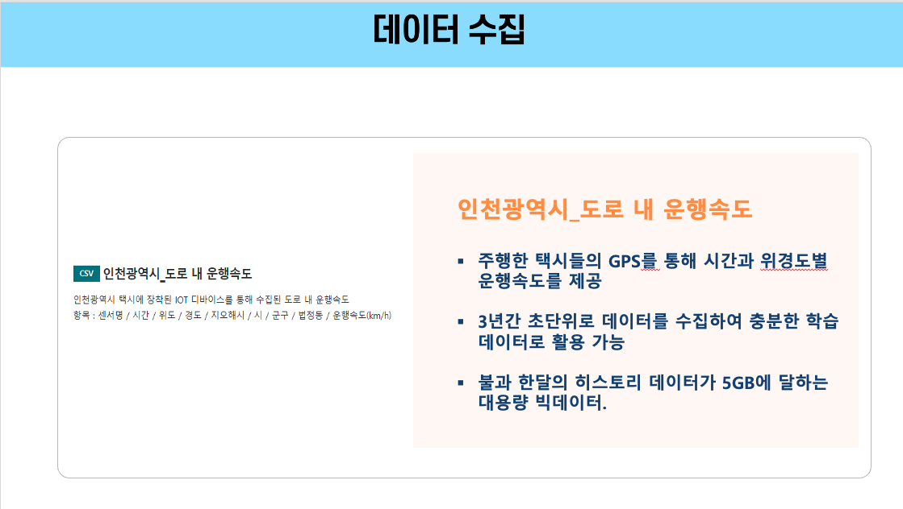
- 팀 만들기를 통해서 팀을 생성할 수 있음.
- 집 모양 아이콘을 클릭하면 해당 팀 워크스페이스로 이동됨
- 내가 속한 팀 목록을 조회할 수 있음

--- 

## 팀 초대
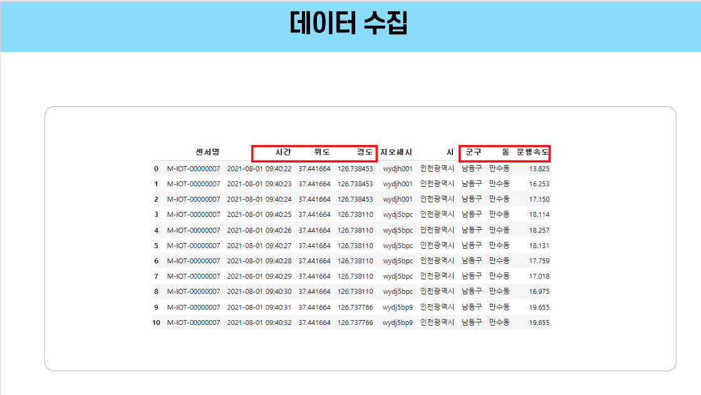
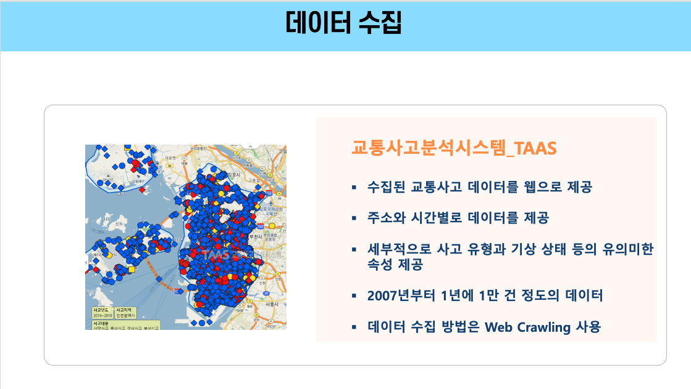
- 내가 속한 팀에 대해서만 다른 유저를 초대를 할 수 있음
- 초대받은 유저는 수락/거절을 할 수 있으며, 수락 시 해당 팀에 속하게 됨
- 자기 자신이나, 존재하지 않는 이메일로는 초대가 불가능함

---

## 팀 메인 화면과 채널 생성
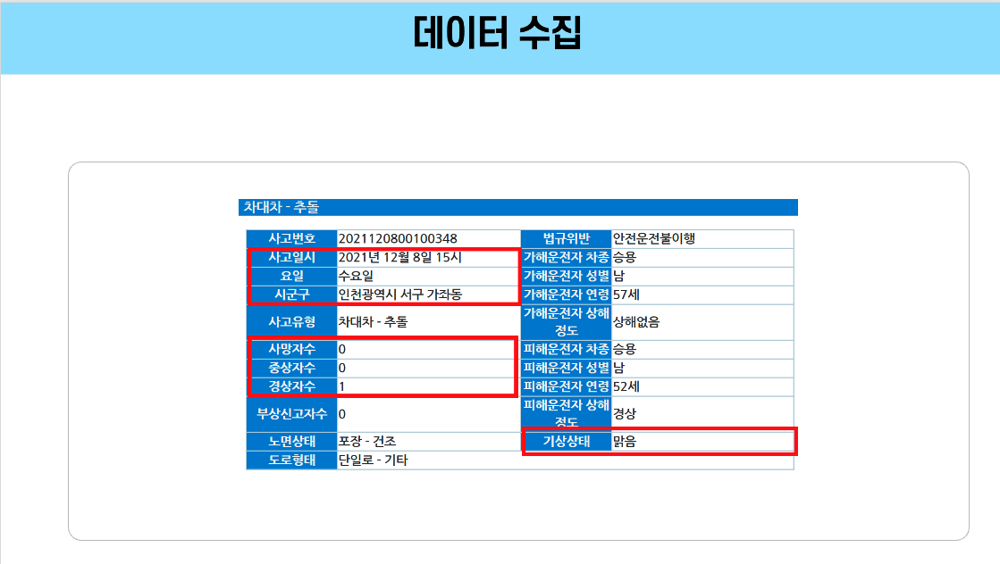
- 팀 안에는 다양한 유형의 채널을 생성을 지원함
- 목적에 맞게 의견 공유를 할 수 있는 채널을 생성할 수 있음
- 개설된 채널 목록은 우측 사이드바에서 확인할 수 있음   
# 
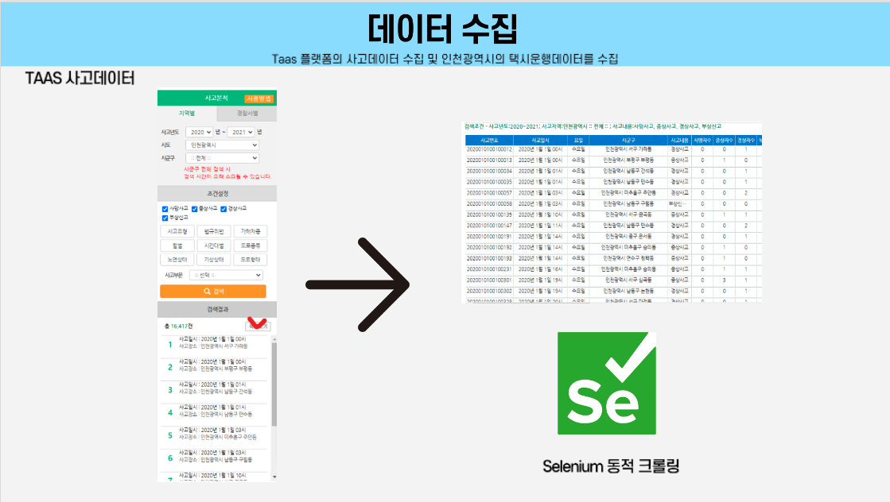
- 다음과 같이 새로운 채널을 개설할 수 있음
- Type에는 DOCS, THREAD, BRAINSTORM, ARGUMENT가 있으며, 목적에 맞는 채널을 생성 가능

---

## 팀 동료 확인

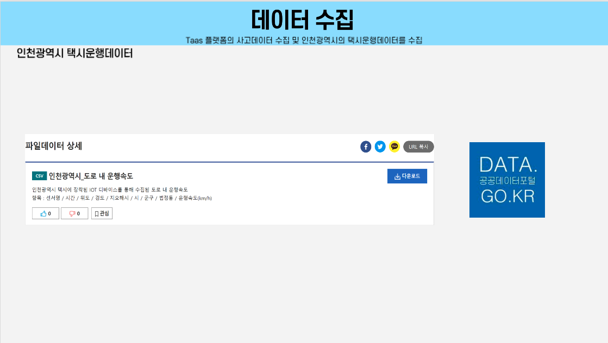
- 현재 팀에 속한 팀 멤버들을 확인할 수 있음

---

## 4가지 채널 유형

---

## DOCS
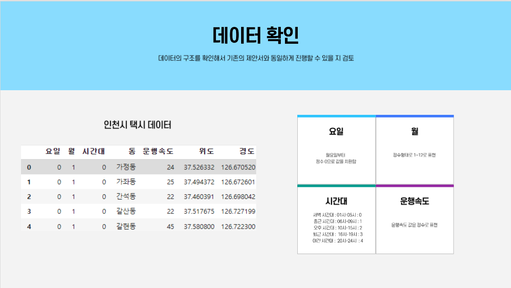
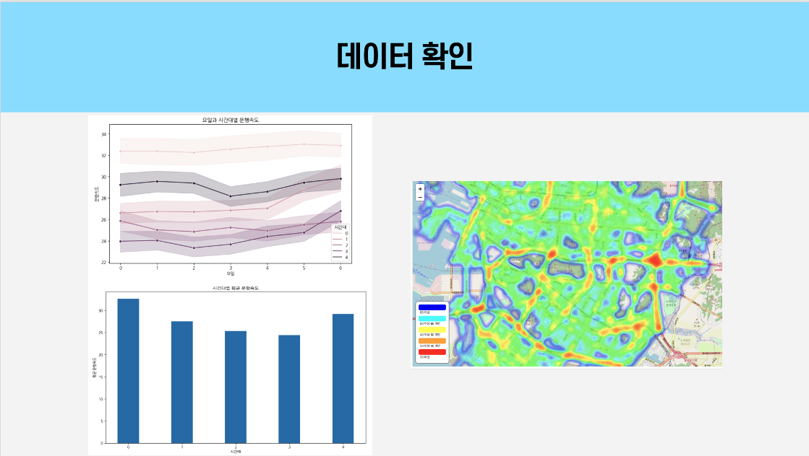
- DOCS 타입 채널은, 문서 정보를 공유하기 적합한 유형의 채널
- 마크다운과 이미지를 첨부할 수 있음

---

## THREAD
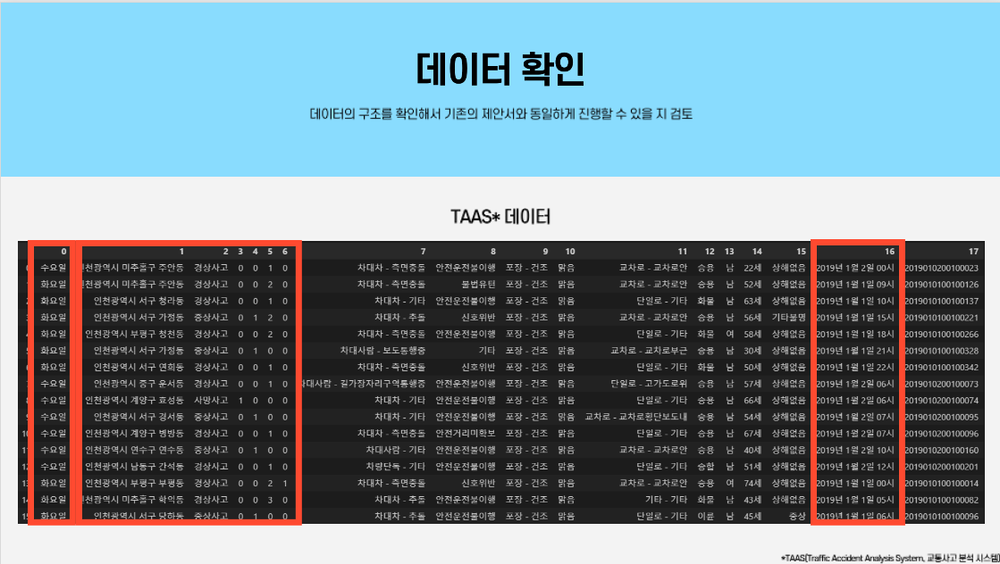
- THREAD 타입 채널은, 말 그대로 내용을 스레드 형식으로 남길 수 있는 채널
- 프로젝트 진행 상황 등을 작성하기 적합

---

## BRAINSTORM
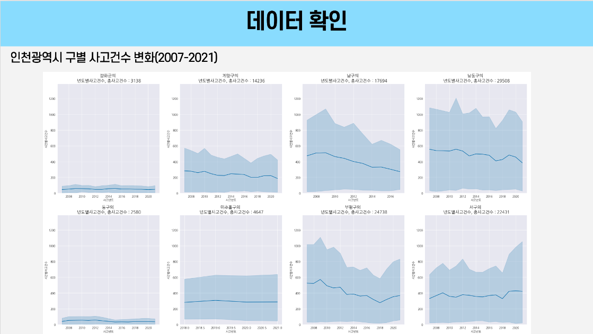
- BRAINSTORM 타입 채널은, 브레인스토밍에서 따온 이름으로, 다양한 아이디어를 자유롭게 제시할 수 있는 채널
- 별점이 가장 높은 3개의 아이디어가 상위에 위치하게 됨
#
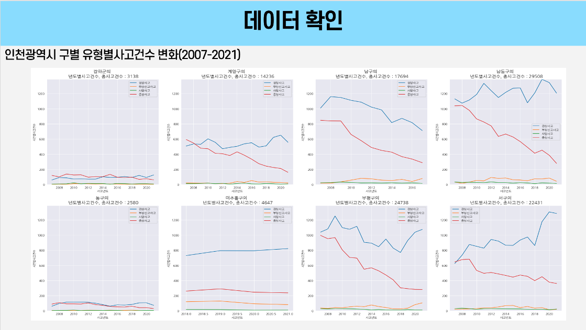
- 댓글을 남길 수 있어, 아이디어에 대한 추가의견을 제시할 수 있음 
#
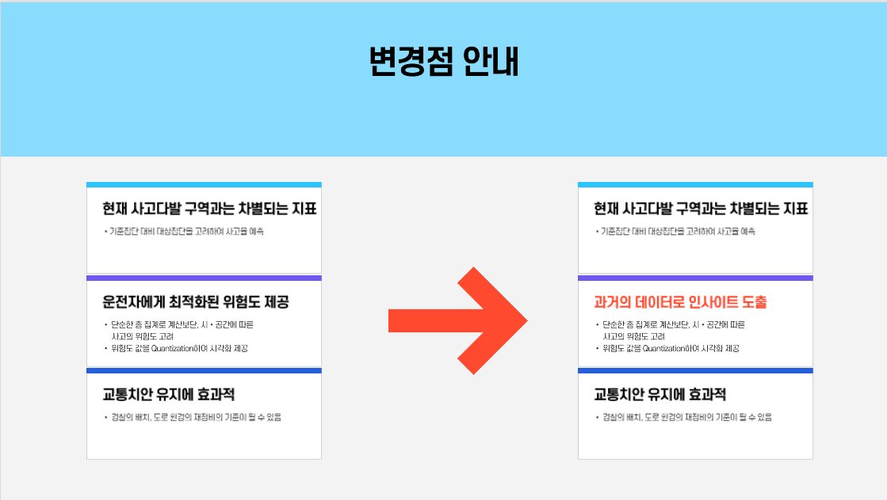
- 별점을 통해서 아이디어에 대한 평가를 할 수 있음.
---

## ARGUMENT
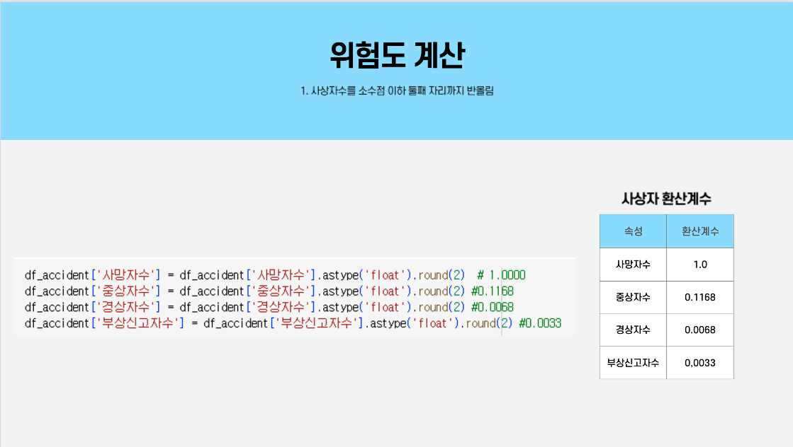
- 하나의 주제에서 시작하여 찬성과 반대, 중립에 대한 의견을 나눌 수 잇습니다.
- 트리 형식으로, 찬성 의견에 대해서 또 찬/반을 논의할 수 있습니다.
#
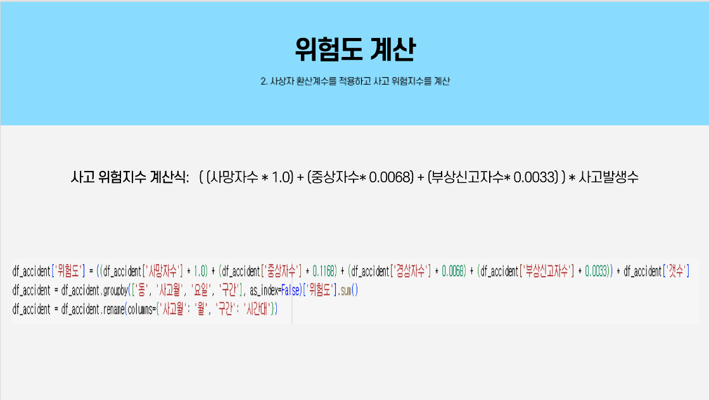
- 찬성/반대/중립 아이콘 클릭 시, 해당 내용에 대해서 하위 의견을 작성할 수 있습니다.
#
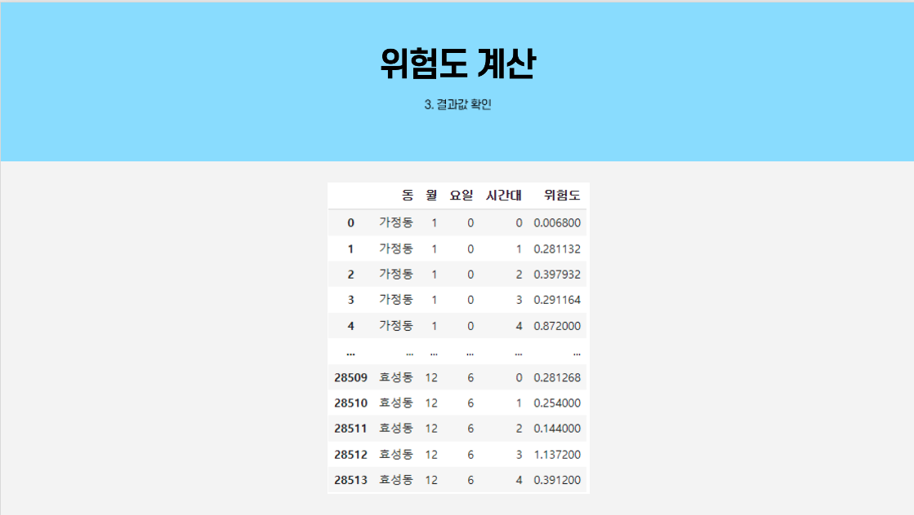
- 의견마다 우측에 댓글을 통해서 남길 수 있습니다.
